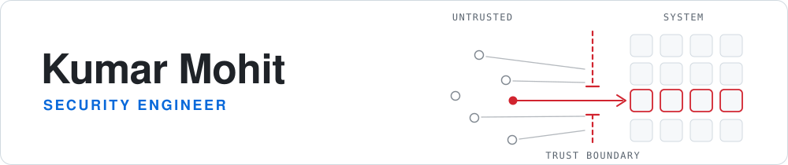
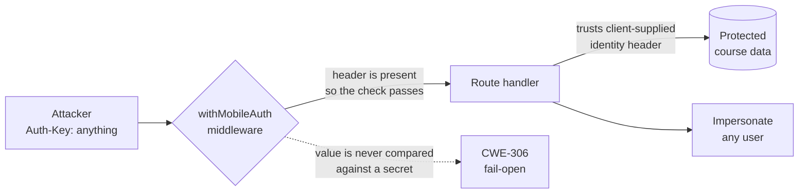

<picture>
  <source media="(prefers-color-scheme: dark)" srcset="profile-assets/banner-dark.svg">
  <source media="(prefers-color-scheme: light)" srcset="profile-assets/banner-light.svg">
  
</picture>

<p align="center"><sub>Four requests are stopped at the trust boundary. One passes through a gap in the check and reaches the system. That gap is <a href="#cve-2026-52021">CVE-2026-52021</a>.</sub></p>

<p align="center">
  <a href="https://www.cve.org/CVERecord?id=CVE-2026-52021"></a>
  <a href="https://www.credly.com/badges/173b0327-fe4d-44db-9765-45aa18f467fb/public_url"></a>
  <a href="https://ieeexplore.ieee.org/document/10914268"></a>
  <a href="https://www.linkedin.com/in/mohitnarayan"></a>
</p>

<p align="center"><sub>Kumar Mohit &nbsp;·&nbsp; also known as Mohit Narayan &nbsp;·&nbsp; India</sub></p>

---

Most of my work sits where untrusted code meets the system running it: secure code review,
hardening containers that execute other people's code, and wiring scanners into CI so problems
fail the build instead of reaching production.

Security Engineer at **[Appfend](https://appfend.com)**. Founder of **Samyora**, where I run
engineering alongside company operations: incorporation, compliance, invoicing, and hiring.

## CVE-2026-52021

<sub>**CWE-306**, Missing Authentication for a Critical Function &nbsp;·&nbsp; [code100x/cms](https://github.com/code100x/cms) &nbsp;·&nbsp; assigned by MITRE, published August 2026</sub>

The Next.js middleware guarding the mobile API tested only that an `Auth-Key` header was
*present*, never that it was *correct*:

```ts
if (req.headers.get('Auth-Key')) {
  return NextResponse.next();   // presence is not validity
}
```

Any arbitrary value passed the check. Handlers behind that guard then trusted a client-supplied
header to decide *who* the caller was, so a fail-open gate plus downstream trust in client input
chained into impersonation and unauthenticated reads of protected data.



**[Read the full CVE-2026-52021 disclosure writeup](https://gist.github.com/itsmohitnarayan/e456399f083130962bab6c710f208437)**

## Upstream contributions

| Project | Contribution | Status |
|---|---|---|
| **[kata-containers](https://github.com/kata-containers/kata-containers)**<br/><sub>7.7k ★ · OpenInfra Foundation</sub> | Firecracker VMM upgrade v1.8.0 to v1.12.1, validated end to end on a K3s cluster through the `kata-fc` RuntimeClass | [#11627](https://github.com/kata-containers/kata-containers/pull/11627)<br/>**merged** |
| **[kata-containers](https://github.com/kata-containers/kata-containers)** | Reported memory and CPU oversubscription failure on K3s v1.32.6 | [#11617](https://github.com/kata-containers/kata-containers/issues/11617)<br/>filed |
| **[AutoMQ](https://github.com/AutoMQ/automq)**<br/><sub>9.6k ★ · Apache-licensed</sub> | CWE-129 array bounds defect in `ByteBufAlloc.java` found via static analysis; fixed the off-by-one causing a runtime `ArrayIndexOutOfBoundsException` | [#3102](https://github.com/AutoMQ/automq/pull/3102)<br/>**merged** |
| **[AutoMQ](https://github.com/AutoMQ/automq)** | Replaced deprecated `X509Certificate.getSubjectDN()` and `getIssuerDN()` with `X500Principal` equivalents | [#3283](https://github.com/AutoMQ/automq/pull/3283)<br/>open |
| **[automq-labs](https://github.com/AutoMQ/automq-labs)** | Reported duplicate credentials and inconsistent placeholders in an OpenShift Helm values example | [#136](https://github.com/AutoMQ/automq-labs/issues/136)<br/>filed |

## Selected engineering work

<sub>Built at Appfend, a multi-tenant platform that runs untrusted tenant code. Descriptions are capability-level; the code is the company's.</sub>

**Behavioral vulnerability validator** &nbsp;<sub>`Go` `chromedp`</sub>
A binary that proves a vulnerability is genuinely exploitable rather than merely present. It drives
real browser flows headlessly and runs differential analysis against vulnerable and patched builds
of the same target, so a finding only passes when the exploit works against one and fails against
the other.

**Fail-closed LLM reverse proxy** &nbsp;<sub>`Go`</sub>
A gateway in front of model backends that denies by default. Unknown routes and methods are
rejected rather than forwarded, and upstream failure surfaces as a clean error instead of leaking
the backend. The property worth having: a misconfiguration produces a closed door, not an open one.

**Container hardening for untrusted workloads** &nbsp;<sub>`Docker` `ECR`</sub>
Removed `sudo`, stripped SUID/SGID bits, restricted the validator binary to root-only, and moved
boot secrets behind encryption so they are not readable from a compromised tenant context.
Published the hardened base image to ECR.

**LLM-as-judge code review grading** &nbsp;<sub>`Python` `Gitea`</sub>
Automated grading of submitted pull requests against per-exercise rubrics, with a fail-safe default
so a misconfigured grader falls back to the restrictive path instead of passing everything.

**DevSecOps detect-and-gate curriculum**
Hands-on material covering SAST, SCA, SBOM, IaC scanning, secrets detection, and artifact signing,
with a four-tier verification methodology so every exercise is proven to work before it ships.

## What I work on

|  |  |
|---|---|
| **Application security** | secure code review, threat modeling, CWE/CVE mapping, exploit path development |
| **Container security** | hardened base images, privilege separation, Kata Containers and Firecracker microVMs, escape analysis |
| **Supply chain** | SBOM generation, artifact signing, dependency and IaC scanning gated in CI |
| **AI/LLM security** | sandboxing untrusted workloads next to models, prompt injection testing, secret isolation |

## Tooling

<p align="center">
  &nbsp;&nbsp;&nbsp;
  &nbsp;&nbsp;&nbsp;
  &nbsp;&nbsp;&nbsp;
  &nbsp;&nbsp;&nbsp;
  &nbsp;&nbsp;&nbsp;
  &nbsp;&nbsp;&nbsp;
  &nbsp;&nbsp;&nbsp;
  &nbsp;&nbsp;&nbsp;
  &nbsp;&nbsp;&nbsp;
  
</p>

<details>
<summary><b>The security toolchain I actually reach for</b></summary>

<br/>

| | |
|---|---|
| **SAST / secrets** | Semgrep, Bandit, git-secrets |
| **SCA / SBOM** | Trivy, Grype, Syft, pip-audit, OWASP Dependency-Check |
| **IaC / images** | Checkov, TFLint, Hadolint, Cosign |
| **Testing** | Burp Suite, Nmap, chromedp, Playwright, pytest, Hurl |
| **Runtime** | Kata Containers, Firecracker, runc, containerd, K3s, KVM/QEMU |
| **Cloud** | AWS: ECR, ECS, Lambda, DynamoDB, IAM cross-account AssumeRole |

</details>

## Research, writing, credentials

| | |
|---|---|
| **[An Effective AI-based Model for Garbage Monitoring: An Application of Smart City](https://ieeexplore.ieee.org/document/10914268)** | IEEE CALCON 2024, IEEE Xplore |
| **[CVE-2026-52021 authentication bypass disclosure](https://gist.github.com/itsmohitnarayan/e456399f083130962bab6c710f208437)** | 2026 |
| **[Contributor: Kata Containers 4.0](https://www.credly.com/badges/173b0327-fe4d-44db-9765-45aa18f467fb/public_url)** | The Linux Foundation, 2026 |
| **[Web Application Pentesting](https://tryhackme-certificates.s3-eu-west-1.amazonaws.com/THM-89KJVILXSD.pdf)** | TryHackMe, 2024 |
| **Ethical Hacking Essentials (EHE)** | EC-Council, 2023 |
| **Cybersecurity Analyst Professional Certificate** | IBM, 2022 |
| **B.Tech, Computer Science** | DRIEMS University, 2025 |

## Currently

Going deep on AWS security with hands-on Terraform rather than console clicking, and doing regular
vulnerability research in container runtimes: runc, Kata Containers, containerd. Staying on one
codebase long enough to understand it beats spraying reports across many. The CVE above came from
that change of approach.

---

<p align="center">
  <a href="https://www.linkedin.com/in/mohitnarayan">LinkedIn</a> &nbsp;·&nbsp;
  <a href="https://tryhackme.com/p/itsmohitnarayan">TryHackMe</a> &nbsp;·&nbsp;
  <a href="https://www.credly.com/badges/173b0327-fe4d-44db-9765-45aa18f467fb/public_url">Credly</a> &nbsp;·&nbsp;
  <a href="https://twitter.com/itsmohitnarayan">X</a> &nbsp;·&nbsp;
  <a href="mailto:mohit724196@gmail.com">mohit724196@gmail.com</a>
</p>

<p align="center">
  
</p>

<p align="center">
  
</p>
